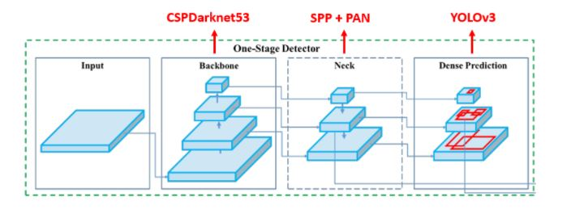
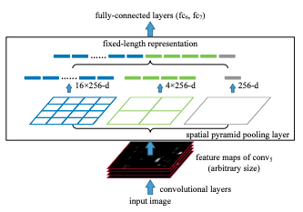
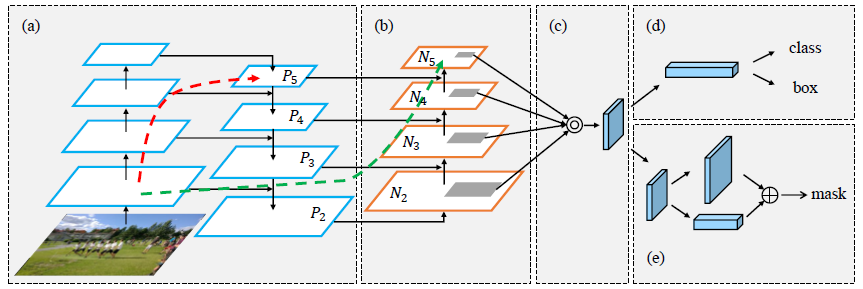

# YOLO v4

## 1. Introduction

최신 Neural Networks들은 높은 정확도를 가지지만, 낮은 FPS와 큰 mini-batch-size로 인해 학습하는데 많은 수의 GPU들이 필요하다는 단점이 있다. 이러한 문제를 해결하기 위해, YOLO v4는 다음과 같은 기여를 제공한다.

1. 일반적인 학습 환경에서도 높은 정확도와 빠른 object detector를 학습시킬 수 있다. 1개의 GPU(ex : GTX 1080 Ti, 2080 Ti)만 있으면 충분하다.
2. detector를 학습하는 동안, 최신 BOF, BOS 기법이 성능에 미치는 영향을 증명한다.
3. CBN, PAN, SAM을 포함한 기법을 활용하여 single GPU training에 효과적이다.

결론은 1개의 GPU를 사용하는 일반적인 학습환경에서 BOF, BOS기법을 적용하여 효율적이고 강력한 Object Detection model 생성.

### Performance

## 2. Bag Of Freebies

추론속도는 유지하지만 학습 전략을 바꾸거나 학습 비용을 증가시켜 정확도를 높이는 방법이다.

+ Data Augmentation
  + Photometric Distortions : brightness, contrast, hue, saturation, noise
  + Geometric Distortions : random scaling, cropping, flipping, rotating
  + CutOut
  + Random Erase
  + MixUp
  + CutMix
  + GAN
+ Semantic Distribution Bias
+ Bounding Box Regression
  + GIOU(Generalized Intersection over Union)
  + CIOU(Complete Intersection over Union)
  + DIOU(Distance Intersection over Union)

## 3. Bag Of Specials

약간의 추론 속도 증가를 통해 정확도를 높이는 방법이다.

+ SPP
+ ASPP(Atrous Spatial Pyramid Pooling)
+ RFB(Receptive Field Block Net)
+ SE(Squeeze-and-Excitation)
+ SAM(Spatial Attention module)
+ LReLU, PReLU, SeLU, Mish  

## 4. Architecture

YOLO v4의 아키텍쳐는 다음과 같다.

   1) Backbone : CSP-Darkent53
   2) Neck : SPP(Spatial Pyramid Pooling), PAN(Path Aggregation Network)
   3) Head : YOLO-v3 

   YOLOv4 = YOLOv3 + CSP-Darknet53 + SPP +PAN + BoF + BoS

## 5. CSP-Darkent53

YOLOv4에서는 CSPNet 기반의 CSPDarkNet53을 제안하였으며, CSPResNext50, EfficientNet-B3에 비해 parameter수와 FLOPS는 많았지만 실제 Inference Time (Throughput)은 가장 좋은 결과를 보이고 있다.

CSPNet은 굉장히 heavy한 inference cost를 완화시키며 정확도 손실을 최소로 할 수 있는 Cross Stage Partial Network 구조를 제안하였으며, 위의 그림과 같이 input feature map을 2개의 part로 나눈 뒤, 하나의 part는 연산에 참여시키지 않고 뒤에서 합쳐주는 방식을 기반으로 inference cost, memory cost 등을 줄일 수 있다. 또한, 학습 관점에서는 gradient flow를 나눠줘서 학습에 좋은 영향을 줘서 정확도 손실이 적다고 한다.

## 6. SPP(Spatial Pyramid Pooling)

먼저 Conv Layer들을 거쳐거 추출된 피쳐맵을 인풋으로 받는다. 그리고 이를 미리 정해져 있는 영역으로 나누어 줍니다. 위의 예시에서는 미리 4x4, 2x2, 1x1 세 가지 영역을 제공하며, 각각을 하나의 피라미드라고 부른다. 즉, 해당 예시에서는 3개의 피라미드를 설정한 것입니다. 피라미드의 한 칸을 bin 이라고 합니다. 예를 들어 입력이 64 x 64 x 256 크기의 피쳐 맵이 들어온다고 했을 때, 4x4의 피라미드의 bin의 크기는 16x16이 된다.

이제 각 bin에서 가장 큰 값만 추출하는 max pooling을 수행하고, 그 결과를 쭉 이어붙여 준다. 입력 피쳐맵의 체널 크기를 k, bin의 개수를 M이라고 했을 때 SPP의 최종 아웃풋은 kM 차원의 벡터이다. 위의 예시에서 k = 256, M = (16 + 4 + 1) = 21 이 됩니다. 정리해보면 입력 이미지의 크기와는 상관없이 미리 설정한 bin의 개수와 CNN 체널 값으로 SPP의 출력이 결정되므로, 항상 동일한 크기의 결과를 리턴한다고 볼 수 있다. 

## 7. PAN(Path Aggregation Network)

1. information path (low levels의 feautre가 topmost로 가는 경로) 를 단축하고, low-levels에 존재하는 정확한 localization 신호로 feature    pyramid를 강화하기 위하여, bottom-up path augmentation (Figure-1의 (b) 부분) 을 생성한다.
2. each proposal과 모든 feature levels 사이에 있는 손상된 infromation path를 복구하기 위해, adaptive feature pooling (Figure-1의 (c)    부분) 을개발한다. Adaptive feature pooling은 임의로 할당된 결과를 피하면서, 각 proposal에 대한 모든 feature levels에서 나온 feature를    집계하는 간단한 구성요소 이다. 
3. tiny fully-connected layers (Figure-1의 (e) 부분) 로 mask prediction을 증축한다. 이 fc layers는 Mask R-CNN이 원래 사용하던 fully      connected network에 대해 보완적 특성을 갖는다. 
