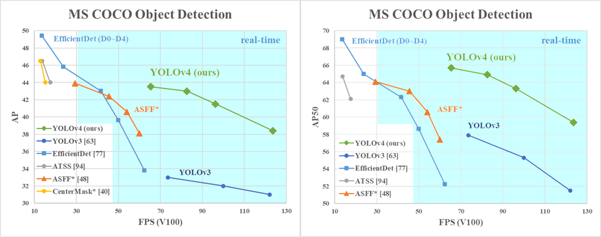

# YOLO v4

## 1. Introduction

최신 Neural Networks들은 높은 정확도를 가지지만, 낮은 FPS와 큰 mini-batch-size로 인해 학습하는데 많은 수의 GPU들이 필요하다는 단점이 있다. 이러한 문제를 해결하기 위해, YOLO v4는 다음과 같은 기여를 제공한다.

1. 일반적인 학습 환경에서도 높은 정확도와 빠른 object detector를 학습시킬 수 있다. 1개의 GPU(ex : GTX 1080 Ti, 2080 Ti)만 있으면 충분하다.
2. detector를 학습하는 동안, 최신 BOF, BOS 기법이 성능에 미치는 영향을 증명한다.
3. CBN, PAN, SAM을 포함한 기법을 활용하여 single GPU training에 효과적이다.

결론은 1개의 GPU를 사용하는 일반적인 학습환경에서 BOF, BOS기법을 적용하여 효율적이고 강력한 Object Detection model 생성.

### Performance

## 2. Bag Of Freebies

추론속도는 유지하지만 학습 전략을 바꾸거나 학습 비용을 증가시켜 정확도를 높이는 방법이다.

+ Data Augmentation
  + Photometric Distortions : brightness, contrast, hue, saturation, noise
  + Geometric Distortions : random scaling, cropping, flipping, rotating
  + CutOut
  + Random Erase
  + MixUp
  + CutMix
  + GAN
+ Semantic Distribution Bias
+ Bounding Box Regression
  + GIOU(Generalized Intersection over Union)
  + CIOU(Complete Intersection over Union)
  + DIOU(Distance Intersection over Union)

## 3. Bag Of Specials

약간의 추론 속도 증가를 통해 정확도를 높이는 방법이다.

+ SPP
+ ASPP(Atrous Spatial Pyramid Pooling)
+ RFB(Receptive Field Block Net)
+ SE(Squeeze-and-Excitation)
+ SAM(Spatial Attention module)
+ LReLU, PReLU, SeLU, Mish  
